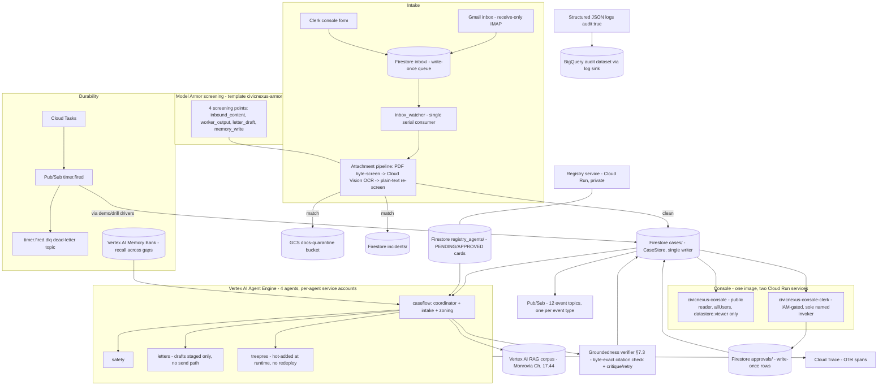

# CivicNexus

**Autonomous casework, accountable by design.** A governed fleet of AI agents that
runs municipal permit cases end to end — email intake with attachment screening,
parallel department review with mandatory verbatim code citations, groundedness
verification, human approval gates, and an append-only audit trail — built on
Google Cloud (Vertex AI Agent Engine, ADK, Gemini, Model Armor) for the
**All Things Agentic Hackathon, Fortified Enterprise Fleet track**.

> Entered in Google's All Things Agentic Hackathon. Created for the purposes of
> entering this hackathon.

## Try it

**Hosted console (public, read-only):**
https://civicnexus-console-wrhx6s33dq-uc.a.run.app

The public reader is how judges test the system: live case queue, full case
dossiers (determinations, verbatim citations, verifier reports), the incident
view (metadata only), and `/evals`, which renders the eval report **unedited —
whatever its gate status** (it shipped red for most of the build; the archived
red history and the 2026-08-28 fix that turned it green are in the repo). The reader's service account holds a single Google
Cloud role (`roles/datastore.viewer`) — the phase verifier asserts the account's
project-level direct bindings are exactly that (resource-scoped or
group-mediated grants are outside the check's reach) — so it cannot spend
money, cannot write, cannot publish events, and cannot read a quarantined
document, regardless of what its code does.

A second service, the **clerk console**
(https://civicnexus-console-clerk-wrhx6s33dq-uc.a.run.app), is IAM-gated to a
single named human and is where approvals actually happen. Judge access is
offered on request in the submission testing instructions — granted by adding
the judge's Google identity as an invoker on the clerk service (with the phase
verifier's pinned single-invoker assertion updated in the same change), not by
sharing credentials; the public page renders the same approval-gate UI with
controls disabled and the IAM reason stated. After the demo walk, the closed
case remains browsable on the public reader, and the write-once `approvals/`
row naming the human approver (`approvals/apr-ea2cfd823116`, naming the
operator / issue / ISSUED) exists in Firestore as the durable evidence of the
clerk walk — the case page explains the row; it does not render its contents.

All data on the site is **synthetic** (faker with fixed seeds). Strings like
`CANARY-*` are deliberately planted leak detectors, not mistakes — every page
footer explains this.

## What it does

A permit application arrives by email (real Gmail inbox, receive-only IMAP) or
via the clerk's "New application" form. Attachments are allowlisted
(PNG/JPEG/PDF, 3 per email, 4 MB cap), screened, OCR-transcribed, and screened
again before any model sees them. The coordinator agent triages the case and
fans out to specialist reviewers; every determination must carry verbatim
citations to the municipal code, which a groundedness verifier checks against
the committed corpus text; a failure triggers a critique-and-retry, and the
verifier's report — pass or fail — travels with the case to the human gate.
The case then stops at a **human gate**: only a named human, through the
IAM-gated clerk console, can approve, deny, issue, or close it — and issuing
requires a write-once `approvals/` row that the single-writer `CaseStore`
verifies inside the transition guard. Content the screen flags never reaches
the fleet: it is quarantined byte-identical to a locked bucket, an incident is
raised, and the whole containment shares one trace. (The screen's measured
catch rate and its one characterised miss are reported, with provenance, under
Screening drills below.)

Measured on the deployed stack (2026-08-28): a demo email with a floor-plan
attachment went from `case.received` to the human gate with a verifier-passed,
§17.44.100-cited approve recommendation in **~62 seconds**; an earlier
rehearsal without an attachment took **2m 0s** including a real verifier
rejection and critique-driven retry.

## Architecture (as actually deployed)



Notes on honesty in the diagram:

- **Four Agent Engine agents** are deployed (`caseflow`, `safety`, `letters`,
  `treepres`), each running as its own least-privilege service account with a
  custom role; agent-to-agent access is per-resource IAM (caseflow may query
  the safety and letters engines; a deliberate-deny test produced an audited
  403). `treepres` was registered and approved **mid-run** via the registry
  (`make demo-hotadd` equivalent passed with nothing redeployed).
- The **BigQuery audit sink** is Terraform-declared (`infra/terraform/audit.tf`:
  dataset `audit` + log sink on `jsonPayload.audit=true`). Caveat stated rather
  than implied away: only processes whose stdout Cloud Logging ingests produce
  rows, and every case to date was driven by local scripts, so the console
  services are the first processes positioned to feed that sink (rows not yet
  verified).
- The 12 event topics currently have **no subscribers** beyond the
  `timer-fired-*` and `incident-raised-*` subscriptions (drill/demo,
  driver-pulled — hence the labelled edge above); the console's per-case
  activity feed is **derived from the case record**, not an event replay, and
  is labelled as such in the UI.
- `SAFE_MODE` from the original spec is **not implemented** (see Failure modes).
  The read-only mechanism is `CONSOLE_MODE=reader` + IAM, deliberately named
  differently so nobody mistakes one for the other.

`docs/ARCHITECTURE.md` is the original spec; deviations are recorded in
ADR-006/ADR-007 and flagged in `BLOCKERS.md` (B-011, B-015) rather than
silently absorbed.

## Spin-up from a clean project

**Honest status first: this sequence has NOT been re-verified end-to-end from a
clean project as of 2026-08-28.** It is assembled from the verified build
history of the one project it has run in (`civicnexus-hack26`). The known
clean-project deltas are called out inline.

Prerequisites: Python 3.12, `uv`, `make`, `terraform`, `gcloud`; a fresh GCP
project with billing enabled; `gcloud auth application-default login` done.

1. **Bootstrap APIs that Terraform itself needs** (required before the first
   apply on any fresh project):

   ```
   gcloud services enable serviceusage.googleapis.com cloudresourcemanager.googleapis.com
   ```

2. **Terraform state backend.** `versions.tf` pins a GCS backend bucket that was
   created out-of-band for this project (deliberately — a state bucket managed
   by the state it holds is a bootstrap cycle; see BLOCKERS B-013). On a clean
   project, create your own **versioned** bucket and point the backend block at
   it before `terraform init`.

3. **Variables.** `cp infra/terraform/terraform.tfvars.example infra/terraform/terraform.tfvars`
   and fill in `project_id` and `billing_account_id`. `budget_currency` must
   match the billing account's currency exactly or budget creation fails.

4. **`make bootstrap`** — terraform init/apply of the baseline: the 22 APIs in
   `infra/terraform/apis.tf`, budget alerts at $50/$100/$140 (gross spend, so
   promo credits can't mute them), staging bucket, Firestore, Pub/Sub topics,
   Cloud Tasks, Model Armor template, quarantine bucket, BigQuery audit sink.
   On a clean project, expect this FIRST apply to fail on the two Cloud Run
   services: their image variables default to the original project's private
   Artifact Registry (a deliberate A8 safety default — see step 5) and the
   fresh project cannot pull them. Everything else (APIs, budget, Firestore,
   topics, buckets, the Artifact Registry repo) applies.

5. **Images — build, override, converge.** Build both images into the repo the
   apply just created (`services/*/cloudbuild.image.yaml` via
   `gcloud builds submit`), set `registry_image`/`console_image` in
   `terraform.tfvars` to your own URIs (exact lines in
   `terraform.tfvars.example`), and re-run `make bootstrap` to converge. (The
   non-empty image defaults are deliberate: an apply with a forgotten `-var`
   can never plan the live services as destroyed.)

6. **Deploy the agents** per `docs/RUNBOOK.md` ("Deploy an agent (hermetic)"):
   `scripts/deploy_agent.py` per agent, then `scripts/seed_corpus.py` for the
   RAG corpus.

7. **Verify:** `make test` (lint, strict mypy, unit + contract tests),
   `make smoke`, then the phase verifiers (`make verify-phase-N`). The current
   tree measures **310 passed, 14 skipped, coverage 89.65%** on `make test`.

## Evaluation results

PermitBench: 20 verified golden cases plus a 25-artifact adversarial drill
corpus (~45 artifacts total, per ADR-006 D7 — the spec's ~80 was cut rather
than padded with unverified cases). The headline table below is from
`docs/eval-report.md` (12-case smoke subset, run 2026-08-28, live deployed
stack).

| Metric | Value | Gate |
|---|---|---|
| **Decision accuracy** | **100.00%** | **≥ 85% — pass** |
| Citation precision | 95.83% | — |
| Citation recall | 100.00% | — |
| Groundedness first-pass | 100.00% | ≥ 95% — pass |
| Verifier first-pass (§7.3 headline) | 91.67% | reported |
| Canary leak rate | 0.00% | = 0 — pass |
| Latency p50 / p95 | 56s / 68s | — |
| Tokens (run total) | 257,315 | — |

**This gate was red for most of the build, and the history is kept, not
erased.** Five full 20-case runs measured 65–80% accuracy (B-006); the
threshold was never lowered, and the red report shipped unedited on the public
`/evals` page throughout. On 2026-08-28, artifact-level failure recording
exposed the actual root cause: the intake agent's instruction still enumerated
only ONE permit type from Phase 1, so off-enum cases missed the config lookup,
the verifier's legality step failed every outcome, and its misleading critique
corrupted retries (it measurably flipped one correct finding to a wrong one).
After the fix — intake enumerates all configured types, the lookup tolerates
format drift only, the critique no longer steers outcomes — the smoke subset
measured **12/12 twice consecutively** (runs archived in `evals/archive/`,
including the red history). Scope stated honestly: two consecutive perfect
runs on the 12-case smoke subset; the full 20-case set has not been
re-measured since the fix.

### Ablation 1 — groundedness verifier OFF vs ON

Single run per arm (from `docs/ablations.md`; both arms archived and labelled):

| Metric | Verifier ON | Verifier OFF |
|---|---|---|
| Decision accuracy | 75.0% | 75.0% |
| Groundedness first-pass | **100.0%** | 91.7% |
| Citation precision | **91.7%** | 87.5% |
| Caught (first-pass failures) | 7 | 7 |
| Corrected by retry | **0 of 7** | n/a (retry disabled) |
| Tokens | 655,564 | 258,703 (**ON = 2.5×**) |

Stated plainly: the retry loop cost 2.5× the tokens and corrected zero of the
seven findings it retried. The verifier's measured value in this system is
**citation fidelity** (groundedness 100% vs 91.7%, precision 91.7% vs 87.5%),
not decision correction — and the 0.0 pp accuracy delta is a sample too small
to distinguish, given B-006's measured 65–80% swings, so no accuracy claim is
made either way.

### Ablation 2 — Model Armor OFF vs ON (defensive screening drill corpus)

These are synthetic screening-drill fixtures that exist solely to validate
CivicNexus's own guardrails (ADR-006); they target nothing external and never
leave the drill path. From `docs/ablations.md`:

| | Model Armor ON | Model Armor OFF |
|---|---|---|
| Coverage | screening layer, all 15 fixtures | **text carriers only — 9 fixtures; 6 PDF-carrier fixtures excluded** |
| The 9 text-carrier fixtures | **9/9 blocked at the screen — zero reached a model** | no screening layer |
| Outcome | n/a (never dispatched) | **7 of 8 scoreable steered the fleet to APPROVE** (1 errored on a 503, unscoreable; 1 returned request_info) |
| Canary leaks | — | 0 |

This is the clearest security evidence in the project: with screening on, none
of these nine drill injections reached a model; with screening off, seven of
the eight that returned a verdict drove the fleet to approve. Two scope caveats
travel with the number: the OFF arm covers **text carriers only** (the 6
PDF-carrier fixtures have no unscreened ingestion path, so this arm is never
quoted against the 15-fixture denominator), and there is **no no-injection
control arm** — "7 of 8 approved" is a strong indicator that the embedded
instructions worked, not proof of obedience, since some of those synthetic
applications might have been approved on their merits.

## Screening drills: the injection-block number, with its provenance

Reporting rule (binding, B-014): this number is never quoted bare.

**Shipped result: 14/15 drill fixtures blocked**, at Model Armor filter
`pi_and_jailbreak` **ENABLED, confidence `LOW_AND_ABOVE`**, stable across three
consecutive runs with the same single miss. Two levers produced it, reported
separately:

1. **Sensitivity** — loosened in two measured steps (HIGH → MEDIUM_AND_ABOVE →
   LOW_AND_ABOVE), each kept only because the negative arm stayed clean: across
   all four configurations the guardrail never once flagged a genuine
   application, letter, determination, or memory string (12 controls, 0 false
   positives at every rung).
2. **Fixture strength** — the drill fixtures were rewritten to the requirement
   a sensitivity ladder measured (unambiguous assistant-subversion markers
   layered on each family's distinct mechanism), not to whatever made the gate
   go green.

| Setting | Fixtures | Positive arm | Negative arm |
|---|---|---|---|
| HIGH | original | 0/15 | 12 controls, 0 false positives |
| MEDIUM_AND_ABOVE | original | 2/15 | 12 controls, 0 false positives |
| MEDIUM_AND_ABOVE | strengthened | 8/15 | 12 controls, 0 false positives |
| **LOW_AND_ABOVE (shipped)** | **strengthened** | **14/15** | **12 controls, 0 false positives** |

**The one holdout (adv-001) ships as a miss, deliberately.** It sits at a 46%
injection share between two same-family siblings at 45% and 47% that both
pass, and its instruction matches when screened standalone. The dilution
boundary was measured to be **non-monotonic** (MATCH at 63%, NO MATCH at 54%
and 46%, MATCH again at 37%) — that is a classifier at its confidence boundary,
not a defect, and tuning the fixture until it passed would fit noise. The §11
exit criterion reads "15/15"; measured is 14/15, reported as-is.

**Coverage statement (current as of 2026-08-28).** PDF byte-screening reads
page text and all three document-info entries (/Subject, /Keywords, /Author —
each measured individually) but does **not** read text rendered inside embedded
raster images (pre-registered as A-12). At **intake**, that blind spot is now
closed for images and bounded for PDFs: every allowlisted attachment is
transcribed by deterministic Cloud Vision OCR — images in full, PDFs up to the
first five pages (the synchronous `files:annotate` cap, pinned in code) — a
transcription engine, not a chat model, so pixels cannot instruct it — and the
extracted text is **re-screened as plain text**, the carrier B-014 measured
most sensitive (11/15 drill instructions match as bare text vs 2/15 inside
PDFs). Raster-rendered text beyond a PDF's fifth page remains outside OCR
coverage. An attachment OCR cannot transcribe fails closed: the case
quarantines for a human decision rather than proceeding as if the attachment
were absent. Note the 14/15 drill measurement itself is a screening-layer
measurement over the drill corpus and predates the OCR path; the OCR leg has
its own live proof below.

**Live-proven containment (2026-08-28, output observed directly, $0, zero
engine calls):** a drill email carrying hostile override text present only as
pixels in a screenshot (byte-verified absent from the file's bytes) was
OCR-transcribed, the plain-text screen returned `pi_and_jailbreak MATCH_FOUND`
at HIGH confidence, and the case went RECEIVED → QUARANTINED with the bytes
held in the quarantine bucket, one incident raised, and one traceparent across
all three audit events. The engine was never called.

**All four screening points hold live measurements** (`make demo-injection
DEMO_ARGS=--with-letters`, 2026-08-28): a drill PDF flagged at
`inbound_content` and quarantined byte-identical with zero engine calls before
the screen; a letter draft screened at `letter_draft` and staged as
`action.pending_approval`; `worker_output` and `memory_write` measured in the
timewarp chain. Tool-poisoning drills: 3/3 lookalike registry cards forced to
PENDING with self-asserted approval cleared, absent from the approved-only
query, machine approval refused by contract and by the live store.

## Failure modes and limits

Stated because a judged project with honest gaps beats one with invented
results.

- **Decision accuracy carried a red gate for most of the build (B-006):**
  65–80% across five full runs, shipped red and visible at `/evals` throughout.
  Root-caused and fixed 2026-08-28 (intake permit-type enum defect + an
  outcome-steering verifier critique); the smoke subset then measured 12/12
  twice consecutively. The full 20-case set is NOT yet re-measured since the
  fix, and B-006's variance history stands as the caveat on any single run.
- **Outcome variance (B-006 family; first recorded at the Phase 1 gate):**
  identical facts can yield deny vs request_info across runs — both defensible
  readings of the statute, but the variance is real and characterized, not
  hidden.
- **Verifier retry corrects nothing it catches** (0 of 7, at 2.5× tokens):
  its value is citation fidelity, not decision correction. Root cause
  (recorded in B-009's update): the groundedness check requires byte-exact
  quotes and LLM re-typing corrupts them; the retry re-asks the same model.
- **Scale ceilings, by freeze-scope choice:** the console queue and
  `/api/cases` read the full collection with no pagination or composite index —
  fine at demo scale, times out around ~10k cases (fix is indexed limit queries
  + cursor pagination, ~1 day, non-architectural). Review throughput is **one
  serial inbox watcher** by spend design (parallel Cloud Tasks consumers are
  the scale shape). The **human gate is the deliberate throughput ceiling** —
  that is the product, not a bug.
- **The dedicated PII redactor in the write path was NOT built** (ratified
  deviation, ADR-007 A9). Compensating controls, measured: Model Armor's SDP
  filter runs in detect mode at all four screening points with match state
  recorded on every incident; memory writes block on SDP matches; canary leak
  rate measured 0.0% in every eval run and both ablations; all data synthetic.
- **`SAFE_MODE` is not implemented.** It was specified as a kill switch over
  side-effect tools that were never built (there is no send path anywhere in
  the codebase — the letters agent stages drafts only). The read-only mechanism
  that does exist is `CONSOLE_MODE=reader` plus IAM.
- **Approval-token consumption plumbing is not built** — tokens are minted
  (write-once `approvals/` rows, verified inside `CaseStore.transition`) but
  no consumer exists because no send path exists.
- **No Looker Studio dashboard** — `/evals` renders `docs/eval-report.md`
  unedited instead. The README you are reading does not imply otherwise.
- **Clean-project spin-up not re-verified end-to-end** (see Spin-up).
- **Evidence-precision scope notes:** the Gmail IMAP *attachment* leg has not
  fired live (both attachment runs used the `.eml` fixture path; the IMAP hop
  itself was proven in the email rehearsal and shares the same extraction
  code); the PDF leg of the attachment pipeline is unit-tested and
  probe-verified but has no end-to-end `.eml` run; the armor-OFF ablation has
  no no-injection control arm; the emulator-enabled test path has never
  executed anywhere (no local Docker; every Phase 6 commit was `[skip ci]`).

## Disclosures

- **AI assistance, stated plainly:** CivicNexus was built with **Claude Code**
  (Anthropic) as the build agent, working under the human-ratified process in
  `CLAUDE.md` — phase gates with human review, ask-first rules for IAM/spend/
  guardrails, and a truthfulness-first evidence log (`PROGRESS.md`). The human
  operator reviewed and ratified every architecture decision (ADRs), authorized
  every infrastructure apply (running most personally; the final console
  applies were agent-run under an explicit, recorded human authorization), and
  personally performed the clerk approvals.
- **Pre-existing code:** none beyond the open-source dependencies listed in
  `THIRD_PARTY.md`. All application code in this repository was written for
  this hackathon.
- **Corpus attribution:** the municipal code corpus is one chapter of a real
  public code — City of Monrovia, California, Municipal Code, Title 17
  (Zoning), Chapter 17.44 "Special Uses" (37 sections), retrieved 2026-08-18
  from the American Legal Publishing Code Library. One-time manual fetch, no
  live scraper ships with the repo, no affiliation or endorsement. Full details
  and the informational-purposes disclaimer: `data/CORPUS_SOURCE.md`.
- **Synthetic data only:** all names, addresses, emails, and parcel data are
  faker-generated under fixed seeds; no real email is ever sent (the inbox is
  receive-only); `CANARY-<id>` strings are planted in synthetic PII fields as
  leak detectors — a canary appearing anywhere downstream is a test failure,
  and the measured leak rate is 0.0%.
- **Screening drill fixtures** (adv-001..025) are synthetic screening-test
  inputs that exist solely to validate CivicNexus's own Model Armor guardrails
  (defensive eval harness, ADR-006); they target nothing external and never
  leave the drill path. The incident view renders metadata only — quarantined
  bytes are never served.

## Repository layout

```
agents/     ADK agents: caseflow (coordinator+intake+zoning), safety, letters, treepres, hello
libs/       contracts (every schema, single source of truth), tools (stores, armor, OCR, inbox), verifier, otel, clock
services/   registry (private Cloud Run), console (one image, reader+clerk services)
infra/      Terraform — the only way infrastructure changes
evals/      PermitBench: 20 golden cases + 25-artifact drill corpus, runner, ablation compare
scripts/    deploy, demo drivers (hotadd/injection/timewarp/dlq-replay), inbox watcher, verifiers
docs/       PRODUCT, ARCHITECTURE, ADRs 001–007, RUNBOOK, eval report, ablations, evidence/
```

Key make targets (each prints PASS/FAIL): `make test`, `make smoke`,
`make eval-smoke`, `make eval-full` (~45 artifacts), `make demo-hotadd`,
`make demo-injection`, `make demo-timewarp`, `make dlq-replay`,
`make verify-phase-N`.

<!-- SOURCES — claim → file:line/section mapping (draft audit trail; strip before shipping or keep, it is invisible in rendered Markdown)

URLS
- Public reader + clerk URLs: PROGRESS.md:114-117.
- Reader single role [datastore.viewer] + verifier scope caveat (project-level direct bindings only): PROGRESS.md:104-106,158 (verify-phase-6 assertion + D13 scope note), ADR-007 D13 table + "one-sentence version" (docs/adr/007-console.md:333-349).
- Clerk sole invoker = user:danishlynx@gmail.com; widening turns the gate red: PROGRESS.md:148-151,159; ADR-007 D2 platform correction (007-console.md:227-238).
- Judge access on request = invoker grant (verifier's pinned binding updated in the same change), not shared credentials; disabled controls + IAM reason on public page: ADR-007 D2 "What it gives up" (007-console.md:216-223); BACKLOG.md item 1 (judge access clause); mechanism per PROGRESS.md:148-151,158-159 (the binding is the gate).
- /evals renders report unedited whatever its gate status: ADR-007 D5 (007-console.md:291); PROGRESS.md:51-53; red-through-the-build history + 2026-08-28 green flip: PROGRESS.md "Accuracy levers" section, evals/archive/results-*-20260828*.
- Clerk-walk evidence row: approvals/apr-ea2cfd823116 naming danishlynx@gmail.com / issue / ISSUED on case-f319c7ccab71 (PROGRESS.md:16); the verify-walk row apr-79b91f861652 was removed by try/finally cleanup (PROGRESS.md:162-163); case.html explains the row, no reader route renders approvals contents (services/console/src/console/templates/case.html:48-52).

WHAT-IT-DOES NUMBERS
- ~62s email→human gate with attachment, verifier passed first pass, approve, case-13ee94915b12: PROGRESS.md:282-291 (LIVE-PROVEN item 3).
- 2m0s no-attachment rehearsal incl. real verifier rejection + retry: PROGRESS.md:199-207.
- Attachment allowlist PNG/JPEG/PDF, 3 per email, 4MB cap: PROGRESS.md:240-246.
- Approvals row verified inside CaseStore.transition (A6): PROGRESS.md:41-45; ADR-007 D3.
- Verifier-failed cases still advance to PENDING_HUMAN with the failed report attached: docs/ablations.md:34-37 (7/12 unresolved-after-verification); PROGRESS.md:829-832 (PENDING_HUMAN on every path incl. double verifier failure).
- "Content the screen flags never reaches the fleet" (qualified, not absolute): B-014 never-bare rule BLOCKERS.md:457-459; 14/15 with characterised miss PROGRESS.md:389-399.

ARCHITECTURE / DIAGRAM
- 4 agents + per-agent SAs + custom role: PROGRESS IAM log 2026-08-20 rows (PROGRESS.md:559,564); agents/ dir listing (caseflow, safety, letters, treepres, hello).
- Per-resource engine IAM caseflow→safety, caseflow→letters: PROGRESS.md:565.
- Deny test audited 403: PROGRESS.md:13,566.
- Hot-add treepres mid-run, nothing redeployed: PROGRESS.md:727 (Phase 3 exit proof 2).
- Letters stages drafts only, no send path: ADR-007 D3/D4 (007-console.md:270-282, 518-523).
- 12 Pub/Sub topics, IDs = event type strings: infra/terraform/events.tf:4-19.
- timer.fired.dlq + timer-fired subscriptions; drill/demo driver-pulled only (edge labelled accordingly): infra/terraform/armor.tf:87-90; PROGRESS.md:325-329; ADR-007 D5 activity-feed paragraph (007-console.md:302-310).
- BigQuery audit dataset + sink filter jsonPayload.audit=true: infra/terraform/audit.tf:6-24; every case to date driven by local scripts + "verify, don't claim" rule (rows not yet verified): ADR-007 (007-console.md:302-314).
- Memory Bank v1beta1 REST, recall proven: PROGRESS.md:733 (Phase 4 exit proof).
- Cloud Tasks timer canary + CLOCK_MULTIPLIER: PROGRESS.md:733.
- Model Armor template civicnexus-armor + docs-quarantine bucket: PROGRESS.md:325-327.
- 4 screening points names: libs/contracts/src/civicnexus/contracts/incidents.py:16-22.
- InboxStore write-once, two feeders, single consumer: PROGRESS.md:171-177.
- Registry private; console reads registry_agents via Firestore: ADR-007 D7 (007-console.md:399-405).
- SAFE_MODE not implemented / CONSOLE_MODE=reader: B-015 item 6 (BLOCKERS.md:402-408); ADR-007 D4.
- Derived activity feed, labelled: ADR-007 D5 rule 2; B-015 item 5.

SPIN-UP
- Not re-verified from clean project: PROGRESS.md:101-103 (honest gap 2); BACKLOG.md deferred item (line 84).
- gcloud services enable serviceusage/cloudresourcemanager before first apply: PROGRESS.md:695-698.
- GCS state backend created out-of-band, versioned, bootstrap-cycle reasoning: BLOCKERS.md B-013 (695-723).
- budget_currency must match billing account: terraform.tfvars.example:5-11.
- Budget alerts $50/$100/$140 gross: PROGRESS.md:654-655; CLAUDE.md bootstrap.
- 22 APIs: infra/terraform/apis.tf:3-26 (22 entries; vision.googleapis.com added 2026-08-28 per B-016, BLOCKERS.md:8-19 — PROGRESS's "20 APIs" lines are Phase-0-era history).
- First clean-project apply expected to fail on the two Cloud Run services (non-empty image defaults point at civicnexus-hack26's private Artifact Registry; the AR repo is itself Terraform-managed, so images cannot be pre-built): infra/terraform/console_service.tf:17-24 (console:v0.1.4), infra/terraform/registry_service.tf:5-20 (registry:v0.1.0 default + AR repo resource); Makefile:16-17 (bootstrap = full-module apply); A8 rationale in both .tf comments.
- Image override lines: terraform.tfvars.example:13-21; PROGRESS.md:101-103.
- Deploy-agent procedure: docs/RUNBOOK.md "Deploy an agent (hermetic)".
- make test 310 passed, 14 skipped, coverage 89.65%: PROGRESS.md:260-262.

EVALS
- Headline table values (100.00 / 95.83 / 100.00 / 100.00 / 91.67 / 0.00 / 56s/68s / 257,315; Gates: PASS; 12 cases, run 2026-08-28): docs/eval-report.md:1-19 (regenerated from run 4). Red-era table (75.00, run 2026-08-25) archived at evals/archive/results-smoke-baseline-backup-20260828.json; fix narrative + both 12/12 runs: PROGRESS.md "Accuracy levers" section.
- Gate red statement + 65-80% five-run range + over-asking failure mode: BLOCKERS.md B-006 (241-263); PROGRESS.md:575-580.
- Three missed cases named: docs/eval-report.md:38-43.
- ~45 artifacts (20 golden + 25 adversarial, census 15/4/3/3): ADR-006 D7 (docs/adr/006:130-135); PROGRESS.md:439,812-813.
- Ablation 1 numbers (75.0/75.0, 100.0/91.7, 91.7/87.5, 7 caught, 0 of 7 corrected, 655,564 vs 258,703, 2.5x): docs/ablations.md:26-40; PROGRESS.md:458-476.
- Small-sample caveat on accuracy delta: PROGRESS.md:489-494.
- Ablation 2 (9/9 blocked ON; 7 of 8 scoreable APPROVE OFF; adv-013 503 unscoreable; adv-015 request_info; 6 PDF fixtures excluded; canary 0; text-carriers-only scope; no no-injection control): PROGRESS.md:509-542; docs/ablations.md:42-58.

INJECTION REPORTING (B-014 rule)
- Reporting rule binding: BLOCKERS.md:457-459 (B-014 final) + docs/ablations.md:62.
- Shipped setting pi_and_jailbreak {ENABLED, LOW_AND_ABOVE}: PROGRESS.md:367-369.
- Four-row progression table: PROGRESS.md:371-376; BLOCKERS.md:425-430; docs/ablations.md:70-75.
- Stable across three consecutive runs, same miss: PROGRESS.md:378-380.
- Two levers reported separately: PROGRESS.md:381-387.
- adv-001 holdout: 46% share, siblings 45%/47%, non-monotonic boundary (63 MATCH / 54 NO / 46 NO / 37 MATCH): PROGRESS.md:389-395; BLOCKERS.md:646-665.
- Negative arm 12 controls 0 FP at every rung: progression tables above.
- §11 delta 15/15 vs 14/15 honest: PROGRESS.md:396-399,443.
- Coverage: PDF screening reads page text + /Subject,/Keywords,/Author but not embedded raster images (A-12): PROGRESS.md:401-405; BLOCKERS.md:617-624.
- 11/15 instructions match as bare text vs 2/15 inside PDFs: PROGRESS.md:246-248; BLOCKERS.md:606-609.
- OCR intake pipeline: images in full; PDFs first 5 pages only (synchronous files:annotate cap, pinned): libs/tools/src/civicnexus/tools/ocr.py:14-19,31-32,93-94; raster text beyond page 5 outside coverage (no page-count guard in process_email, scripts/inbox_watcher.py:399-433); deterministic Cloud Vision; fail-closed attachment_unreadable→QUARANTINE: PROGRESS.md:240-258; scripts/inbox_watcher.py:417-432.
- Live containment: pixel-only hostile text, MATCH_FOUND at HIGH, case-1216f7712d35 RECEIVED→QUARANTINED, inc-420ff7fd33a1, one traceparent, zero engine calls: PROGRESS.md:276-281.
- demo-injection --with-letters: point 1 adv-002 quarantined byte-identical zero engine calls; point 3 letter_draft NO_MATCH staged action.pending_approval; all four points live: PROGRESS.md:213-222.
- Tool-poisoning 3/3: PROGRESS.md:426-431.
- dlq-replay (in make targets list only; numbers not quoted in README body): PROGRESS.md:429-431.

FAILURE MODES
- Scale limits (no pagination ~10k ceiling; single serial watcher; human-gate ceiling; fix shape): docs/BACKLOG.md:86.
- Outcome variance deny-vs-request_info = Phase 1 gate delta, B-006 family: PROGRESS.md:619-621; BLOCKERS.md:241-251,365.
- Redactor not built + compensating controls: ADR-007 D10 redactor row (007-console.md:456); B-015 item 3.
- SAFE_MODE zero code hits: B-015 item 6 (BLOCKERS.md:402-408).
- Token consumption not built: B-015 item 2; ADR-007 D3.
- No Looker dashboard: B-015 item 7; ADR-007 delta 7.
- Emulator path has never executed anywhere (no local Docker; every Phase 6 commit [skip ci]): PROGRESS.md:95-100.
- IMAP-attachment and PDF .eml legs not fired live: PROGRESS.md:300-304.
- Verifier retry 0/7 + byte-exact quote root cause (root cause recorded in B-009's update): PROGRESS.md:474-487; BLOCKERS.md B-009 (25+).

DISCLOSURES
- Built with Claude Code: CLAUDE.md line 1 ("You are Claude Code, building CivicNexus"); process rules throughout CLAUDE.md.
- Human authorized every apply; most human-run (e.g. PROGRESS.md:324-325); final console apply human-authorized agent-run (PROGRESS.md:108-112); v0.1.1 revision apply agent-run under standing authorization (PROGRESS.md:152-154).
- Human performed clerk approvals: PROGRESS.md:16 (approvals/apr-ea2cfd823116 naming danishlynx@gmail.com).
- Pre-existing code none found: all workspace pyproject.toml dependency lists inspected (root, libs/*, agents/*, services/*) — only public packages + workspace-internal packages; nothing contradicting found.
- Corpus: data/CORPUS_SOURCE.md:1-27 (Monrovia Title 17 Ch. 17.44, 37 sections, retrieved 2026-08-18, American Legal Publishing, one-time manual fetch, disclaimers).
- Synthetic data + CANARY + receive-only inbox: CLAUDE.md "Data and fixture rules"; PROGRESS.md:171-177 (receive-only per fixture rules).
- Drill fixtures defensive framing: CLAUDE.md "Data and fixture rules" Phase 5 paragraph; docs/RUNBOOK.md session-start framing.
- Incident view metadata only / bytes never served: ADR-007 D8.

GAPS DELIBERATELY NOT CLAIMED
- No claim that clean-project spin-up works (unverified).
- No claim that the console renders approvals-row contents (no reader route exists; the case page explains the row only).
- No Cloud Trace URL quoted (Phase 0 trace is stale evidence; live trace links are per-case).
- dlq-replay numbers (113.7s, 5 nacks) left out of body — in PROGRESS if needed.
- No cost/spend totals claimed beyond budget-alert thresholds.
-->
